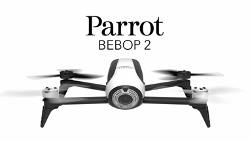

=================================
Getting started with Parrot Bebop
=================================

What is the Parrot Bebop 2 drone?
=================================

The Parrot Bebop is a Wi-Fi controlled flying quadrotor, designed to be operated with a smartphone or tablet via the
official FreeFlight app. The Bebop is a lightweight drone with a built-in HD camera.

At the end of 2015 Parrot released the Bebop 2, the successor to the Parrot Bebop. Both drones are supported by the
`Paparazzi <http://wiki.paparazziuav.org/>`__ community and pre-configured airframe files are available.

Where to start
==============

You do not need to electronically modify the Parrot Bebop in order to fly with Paparazzi. It is recommended to first
get familiar with the Paparazzi system and then follow this page to perform a manual flight. The guide assumes
the following hardware:

- `Parrot Bebop 2 <https://www.parrot.com/us/drones/parrot-bebop-2>`__
- `Hobbyking 6CH USB radio <https://hobbyking.com/en_us/hobbyking-6ch-rc-flight-simulator-system-mode-2.html>`__
- Computer with :doc:`Paparazzi </paparazzi>` installed

Video tutorial
==============

This video will give step by step instructions on performing a manual flight with the Parrot Bebop 2. You will compile
a well-tested autopilot and upload it to the drone. Then, with the `Ground Control Station <http://wiki.paparazziuav.org/wiki/GCS>`__
as user interface, you can fly the drone in `attitude hold <http://dronetrove.com/altitude-hold-mode-drones/>`__ mode.

.. raw:: html

    

        <iframe src="https://www.youtube.com/embed/8qlilEMgPno"
            frameborder="0"
            allowfullscreen
            style="position: absolute; top: 0; left: 0; width: 100%; height: 100%;">
        </iframe>
    

